As a side project, I've been trying to recreate 
[REZZ's Crazy LED glasses](./../_assets/led_glasses_initial/rezz.jpg). 
Seemed like a great and usable introduction to embedded programming, as well
as using fields outside of programming (Electronics, 3D Design, Music). 

There are [other replicas](https://www.etsy.com/listing/545785280/arcane-led-goggles-88-full-color-leds?ga_order=most_relevant&ga_search_type=all&ga_view_type=gallery&ga_search_query=led%20goggles&ref=sr_gallery-1-1)
currently made, most of them using various [NeoPixel rings](https://www.adafruit.com/product/1463)
wired together. These are all impressive works, but they are a tad too different from the original
glasses for my liking, I'd rather use through-hole pixels than the SMD versions.

A Teensy3 microcontroller is being used to power the glasses, due to its large memory, cost, 
and slim profile. Through-hole WS2812 LED's ("NeoPixel") were chosen due to beging individually
addressable, as well as being the right size.

Using custom Printed Circuit Boards seemed like the best way to go about this. With such a small
space inside each frame, hand soldering LEDs together would be extremely cumbersome, and take
up too much space as well. NeoPixels also advise the inclusion of a 0.1µF capacitor between each
pixel, to prevent misbehavior. It's unlikely a capacitor would also fit inside the frame.

## PCB and Circuit Layout

Each NeoPixel has a data_in, data_out, v_in, and ground pins. The first pixel starts at 9-0'clock
on the board's outer ring, and continues clockwise until connecting to the next inner ring. 

KiCAD was used to design the PCB, with the outline being imported from a AutoDesk Fusion 360 sketch. 
Getting the LED holes and Capacitor plates to the right radial position and angle was achieved by
using KiCad's Python scripting console (so nifty!). Being my first time ordering PCBs, I didn't know
if it was possible to connect the bridges between the rings, so I included pins on the internal rings
for the data/power/ground supplied.

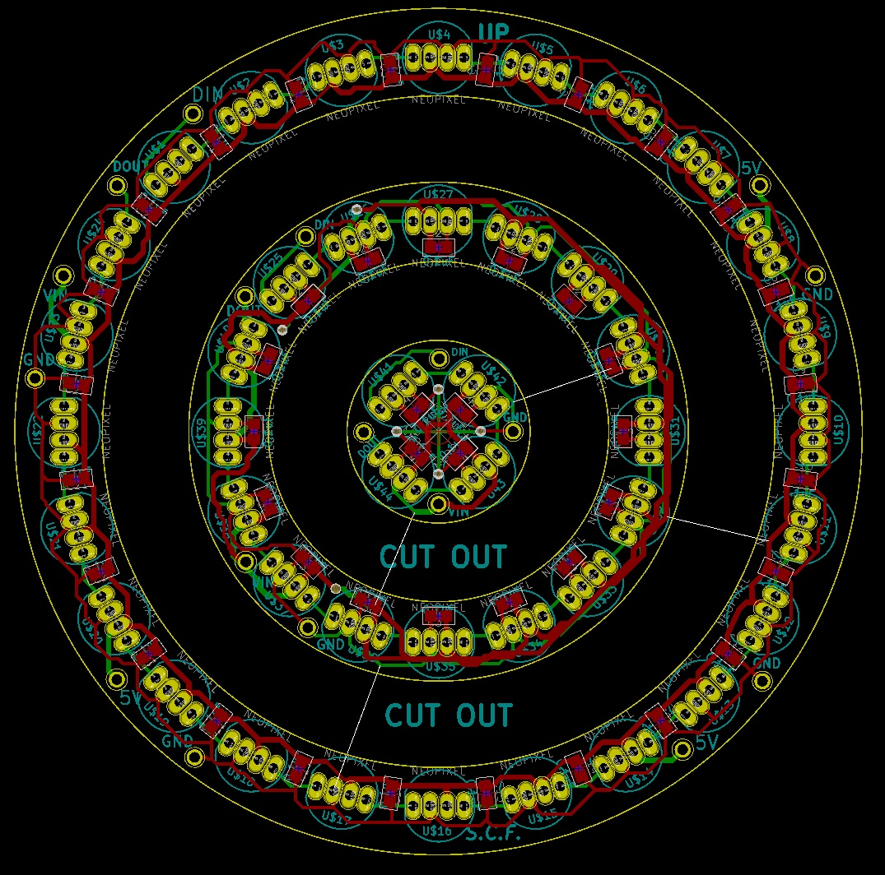

Using OSHPark to print, turned out very well. 

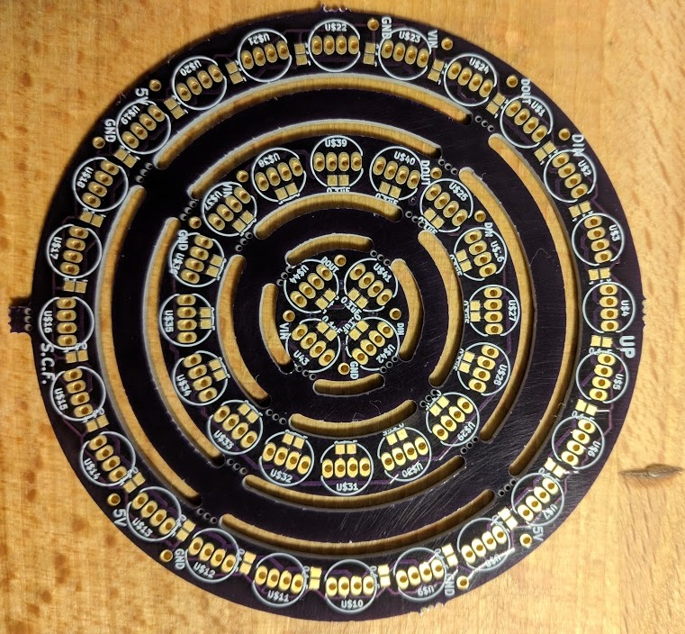

## Soldering
I've never soldered before, so this was absolutely a learning experience

Firstly, SMD 0.1µF capacitors were soldered using a Reflow oven.

(This was a huge pain, I underestimated how small the capacitors would really be)

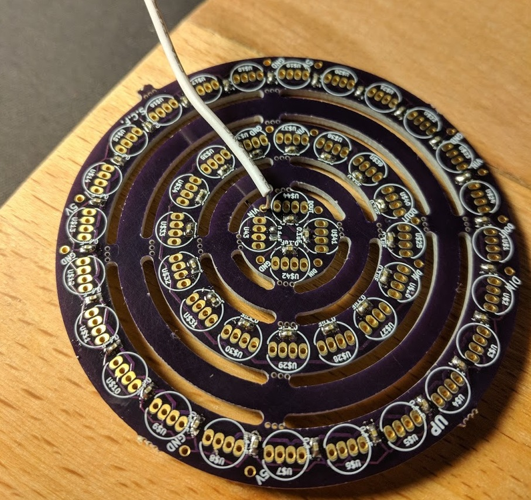

Now for the LEDs...

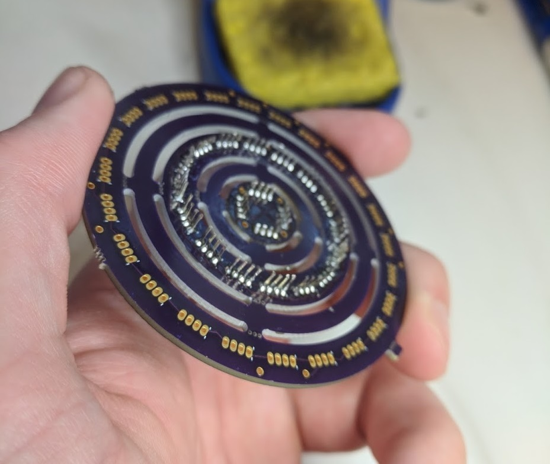
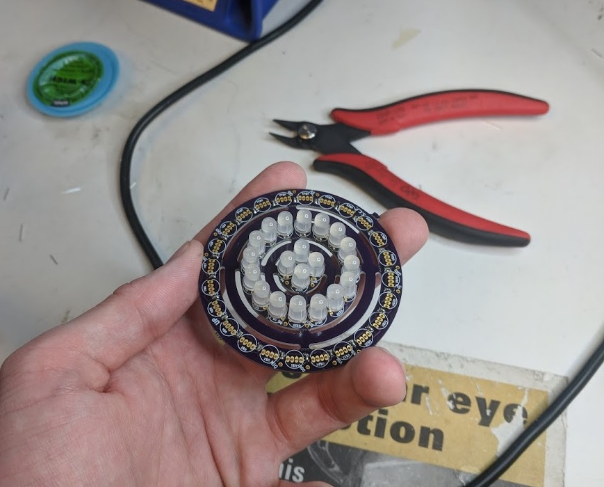

And some testing...

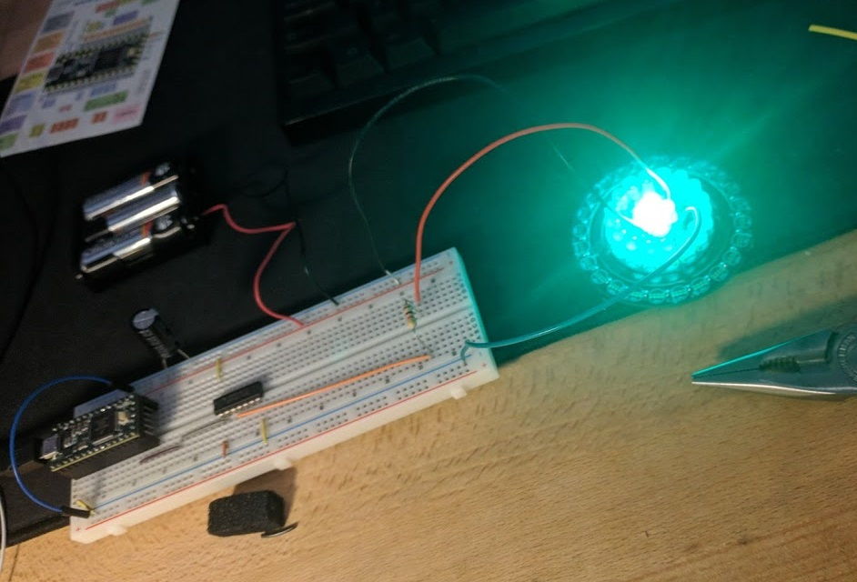

Finally, the rest.

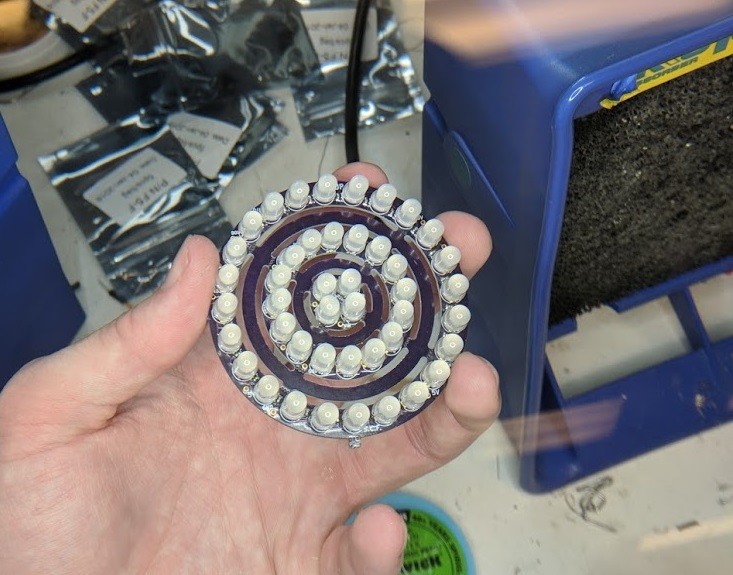

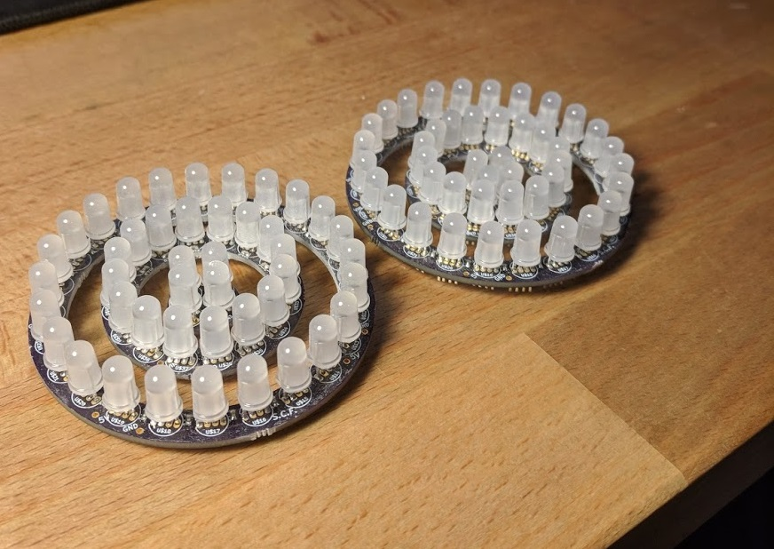

They turned out great! 

## 3d Printed Front Panel

I printed out a dummy front panel for just one side. The LEDs fit fairly snugly inside - 
no need for any screws holding it in

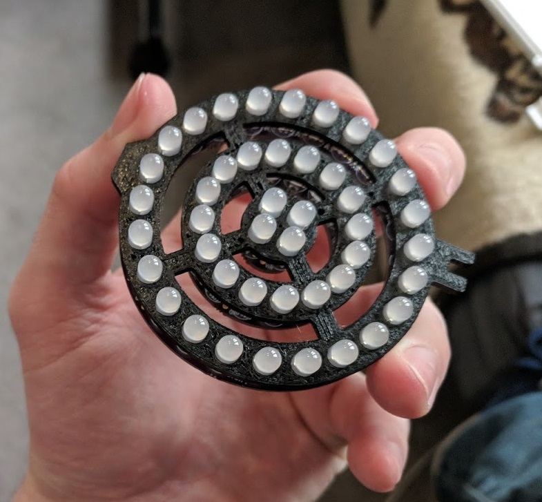

However, wiring turned out to be **_ugly_**.

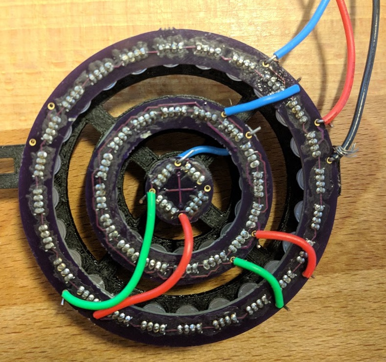

## Round 2

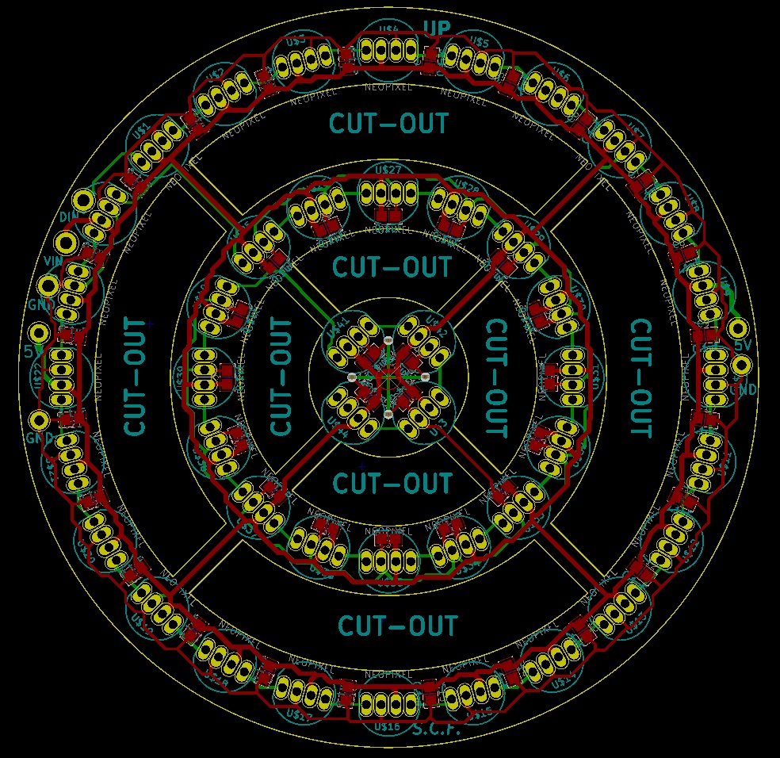
